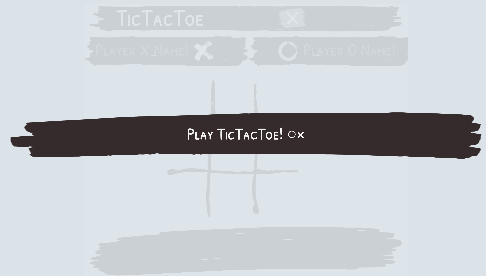

## [Click me and have a Go! XO](https://kendlc.github.io/Project0-Tictactoe/)

# TicTacToe - Project0
=======================

## Technologies:
* HTML
* CSS
* JavaScript

### DOM Manipulation
* jQuery

## About

A simple Tictactoe game that gives off a nice and responsive interface for users to enjoy.

### Features
* **Start Screen**
* **Player Name Inputs**
* **Token Option** _:let players choose who goes first_
* **Game Round Counter**
* **Score Display**
* **Message Display** _:prompts player turns, and round winner_
* **Rematch Button**  _:starts another round_
* **Close Button** _:ends the game_
* **Winner Screen** _:tallies score and displays game winner upon clicking close button_
* **Display Transition and Animation**
* **Bouncing Button Animations**
* **Background Music**
* **Button Sounds**
* **Winner Sounds**
* **Game board Sounds**
* **Screen size adaptability** _:can resize to computer screens (minimum : 1080p x 720p)_

### In-game Photos




<!-- ### Approach
In making this game, my thoughts were to make a product that would atleast compare to Tictactoe apps and games on the market and provide a very nice experience to users. For this reason, I decide focus on interactivity, responsiveness, and the visuals of the game. -->


### Approach

My
progress 2: working logic
progress 3: shortened code
progress 4: game done - fixing game visuals and initiation - adding features
progress 5: restart and close buttons / name input and display / round and score display
progress 6: choosing which player goes first / winner screen after ending game
progress 7: visuals / added image background and buttons
progress 7: add bouncing animation on hover and iteration/ fixed sizing to fit any desktop screens / fixed header and vh on board and footer
progress 7: added transitions
Progress 8: added bg music / victory sound/ button sounds


A first level heading
=======================

A second level heading

-----------------------

Markdown understands paragraphs.

See?

# Heading

## Subheading

### Subsubheading

> I never said that.

## Text formatting

That is _italics_ or *bold*.

You can probably guess what ___this___ does.

This is also ***bold italics***

## Lists

* groucho
* harpo
* chico

1. vanilla
1. chocolate
1. caramel

## Links

[This is the link](http://ga.co/)

## Images


## Code

The name of the variable is `riplvb`. We often use `console.log`.

```javascript
const hey = function(){
    console.log('hey!');
}
```

```ruby
def hey
    puts "hey"
end


