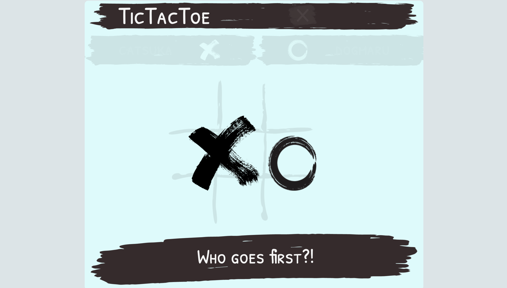
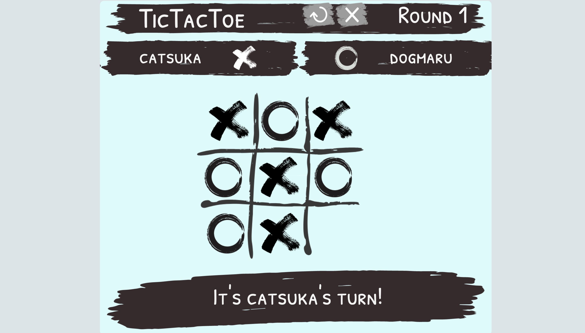
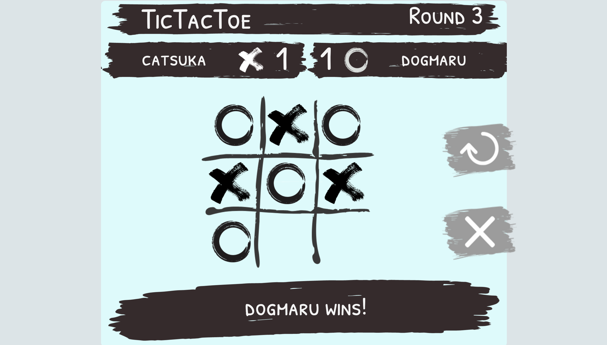
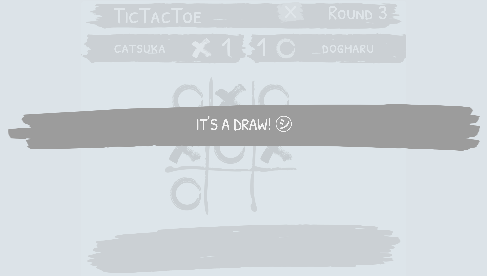

## [Play now!](https://kendlc.github.io/Project0-Tictactoe/)

# TicTacToe - Project0

## About

A simple Tictactoe game that gives off a nice and responsive interface for users to enjoy.

## Technologies:
* HTML
* CSS
* JavaScript

### DOM Manipulation
* jQuery

## Features
* **Start Screen**
* **Player Name Inputs**
* **Token Option** _:let players choose who goes first_
* **Game Round Counter**
* **Score Display**
* **Message Display** _:prompts player turns, and round winner_
* **Rematch Button**  _:starts another round_
* **Close Button** _:ends the game_
* **Winner Screen** _:tallies score and displays game winner upon clicking close button_
* **Display Transition and Animation**
* **Bouncing Button Animations**
* **Background Music**
* **Button Sounds**
* **Winner Sounds**
* **Game board Sounds**
* **Screen size adaptability** _:can resize to computer screens (minimum : 1080p x 720p)_

### In-game Photos

### Approach
In making the game, I made sure to finish the game logic and functions first. Afterwards, I planned out the features that I wanted in the game and then made the game layout. Lastly, I finished the project with adding the visuals, transitions, animations, and sounds. 

Subsequently, for each feature that I added, I made sure that the feature is debugged (e.g. when choosing token on who goes first, everything else on the screen is unclickable) before moving on to adding the next feature for easier debugging.

As for my code, I separated my logic functions into `logic.js` and event handers in `object.js` to keep my codes tidy and easier to read. 

